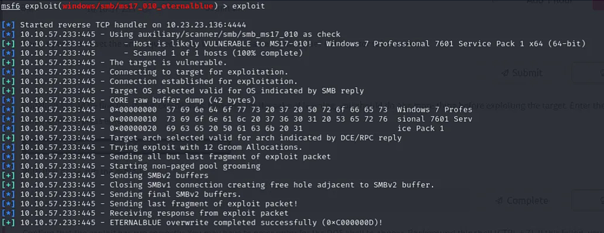
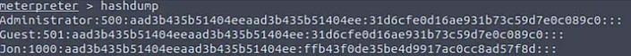
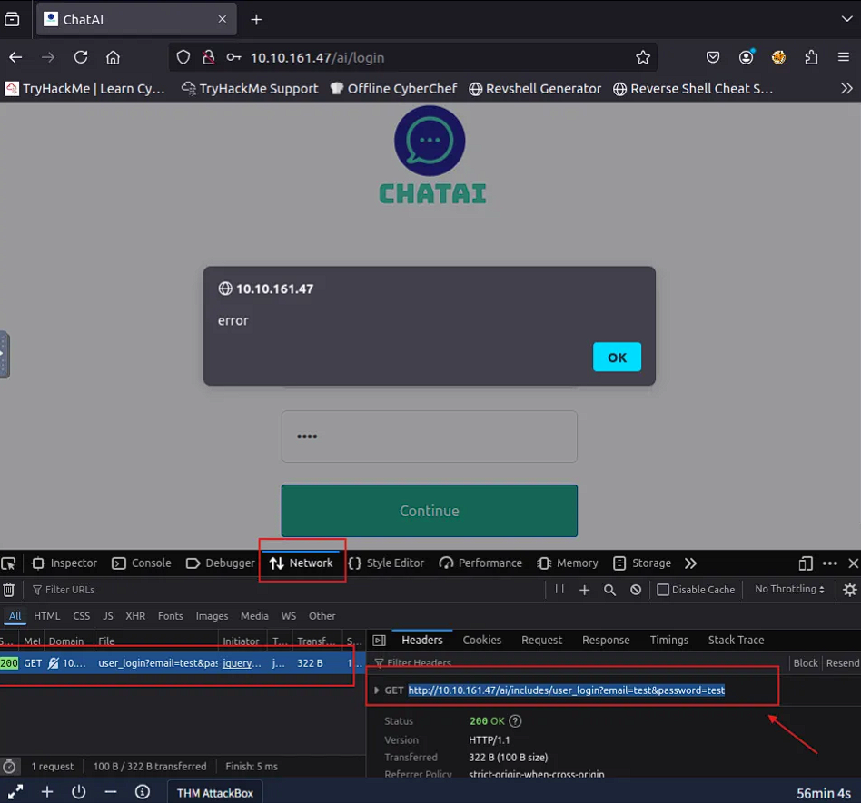
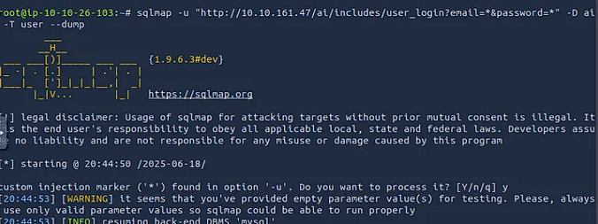
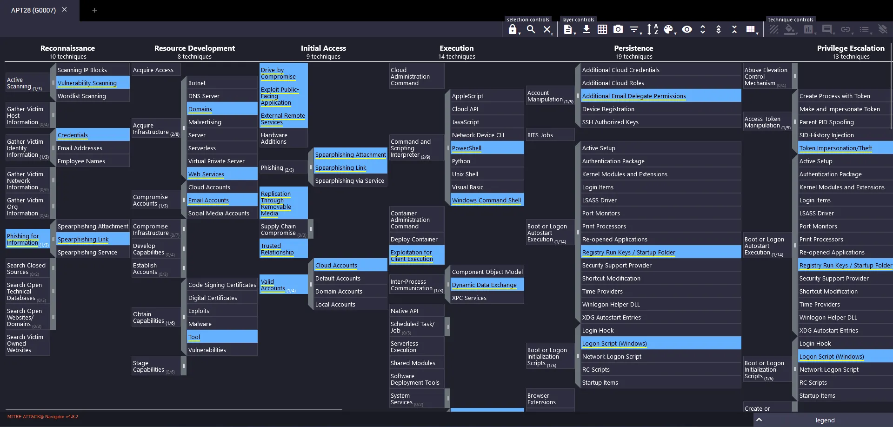
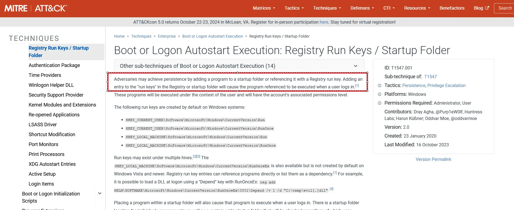

# 🛡️ Cybersecurity Portfolio

Welcome to my hands-on cybersecurity portfolio. These projects demonstrate real-world offensive security techniques I've learned and practiced through platforms like TryHackMe.

---

## 📂 Projects Index

- [🔓 Windows Eternal Blue Compromise](#-windows-eternal-blue-compromise)
- [🩻 SQL Injection with SQLMap](#-sql-injection-with-sqlmap)
- [🚪 Eviction Room: SOC Level 1 - Cyber Defence](#-eviction-room-soc-level-1---cyber-defence)

--- 

## 🔓 Windows Eternal Blue Compromise

> **Tools Used**: TryHackMe, Metasploit, John the Ripper, Windows, Rainbow Tables

### 🧠 Overview
This project was part of a TryHackMe challenge that focused on exploiting a Windows machines MS17-010 SMB vulnrablitity. My goal was to simulate a real attack: gain access, escalate privileges, and extract credentials from a Windows system.

### ⚙️ What I Did
1. **Scanned the target** using `nmap` to identify open ports and services.
2. Found that the machine was vulnerable to **MS08-067**, a well-known Windows SMB exploit.
3. Used Metasploit’s `ms08_067_netapi` module to **gain access** via Meterpreter.
4. From the shell, I performed **privilege escalation** to SYSTEM.
5. Dumped password hashes using `hashdump` from the SAM database.
6. Cracked the hashes using **rainbow tables** and **John the Ripper**.

### 🖼️ Screenshots



### ✅ What I Learned
- How to identify SMB vulnerabilities through enumeration.
- Post-exploitation techniques using Meterpreter.
- Credential harvesting and hash cracking methodology.
- Realized the importance of patching legacy systems.

---

## 🩻 SQL Injection with SQLMap

> **Tools Used**: SQLMap, TryHackMe, Burp Suite, Linux Terminal

### 🧠 Overview
In this project, I explored how SQL injection vulnerabilities can be detected and exploited. The lab simulated a vulnerable web app where I used SQLMap to automate the attack process.

### ⚙️ What I Did
1. Used browser dev tools and **Burp Suite** to inspect HTTP requests and discover vulnerable `id` parameters.
2. Ran **SQLMap** to enumerate databases and tables:
   ```bash
   sqlmap -u "http://vulnerable.site/page.php?id=1" --dbs
   sqlmap -u "http://vulnerable.site/page.php?id=1" -D users -T creds --dump
   ```
3. Dumped sensitive data including user credentials from the `users` table.
4. Took screenshots of the commands and results for documentation.

### 🖼️ Screenshots



### ✅ What I Learned
- How attackers identify and exploit SQL injection points.
- Using Burp Suite for traffic inspection.
- Practical application of automated SQLi tools.
- The importance of input sanitization and prepared statements.

---

## 🚪 Eviction Room: SOC Level 1 - Cyber Defence

> **Tools Used**: TryHackMe, MITRE ATT&CK Navigator, Windows Command Shell, PowerShell

### 🧠 Overview
The Eviction Room on TryHackMe simulates how a SOC analyst can detect, map, and defend against adversarial techniques used by **APT28**. Using the **MITRE ATT&CK framework**, I tracked persistence, execution, and evasion tactics while simulating an active defense scenario.

### ⚙️ What I Did
1. **Mapped APT28 behaviors** using the MITRE ATT&CK Navigator to understand TTPs.  
2. Identified **initial access techniques** such as spearphishing attachments and malicious links.  
3. Detected execution attempts via **PowerShell** and **Windows Command Shell**.  
4. Tracked persistence through **Registry Run Keys** and analyzed defense evasion using `rundll32.exe`.  
5. Investigated discovery via **network sniffing** tools like `tcpdump`.  
6. Observed lateral movement through **SMB/Windows Admin Shares**.  
7. Determined the adversary’s objective of **intellectual property theft** targeting **SharePoint** repositories.  
8. Identified possible exfiltration methods using **external and multi-hop proxies**.  
9. Successfully “evicted” the threat before it could complete data exfiltration.  

### 🖼️ Screenshots
  
  

### ✅ What I Learned
- How to use the **MITRE ATT&CK framework** to track adversary behavior.  
- Practical detection of persistence, execution, and lateral movement techniques.  
- The value of structured defense frameworks in incident response.  
- Reinforced the role of a SOC analyst in stopping real-world APTs.  

---
## 📢 Let's Connect
- [GitHub](https://github.com/davidhnna)
- [LinkedIn](https://linkedin.com/in/david-hanna-a73756304/)

